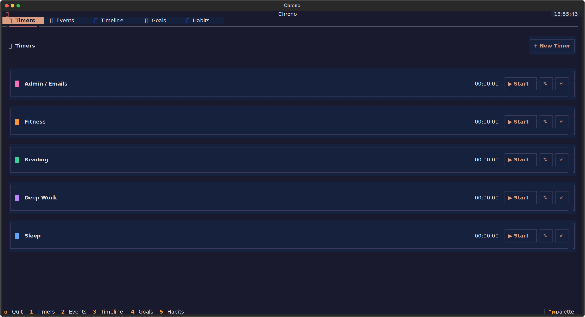
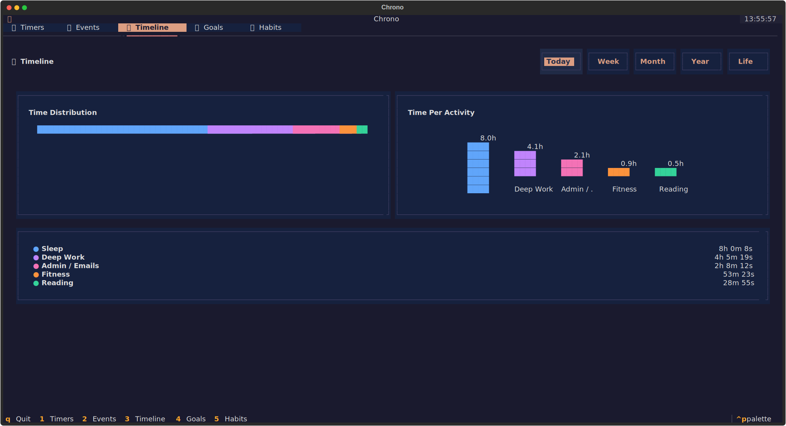
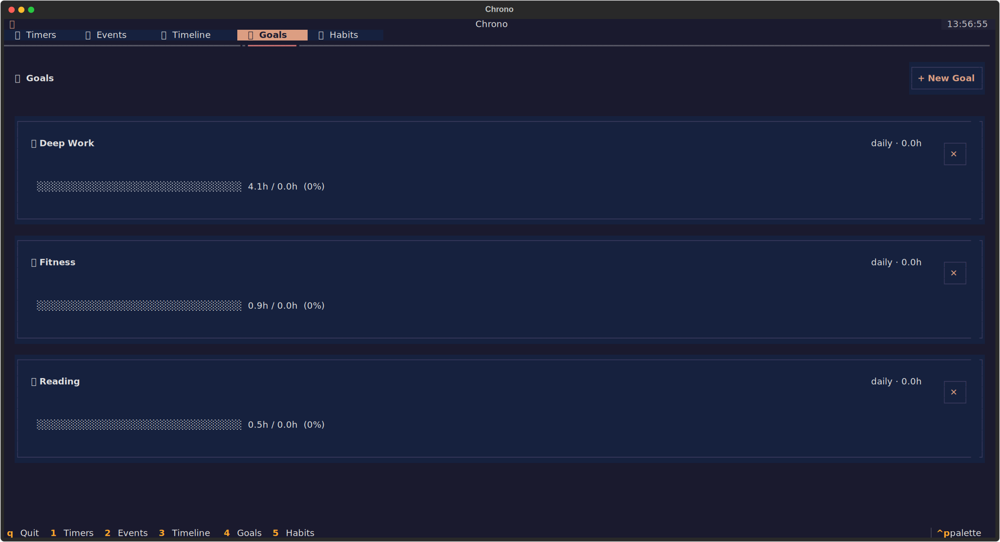
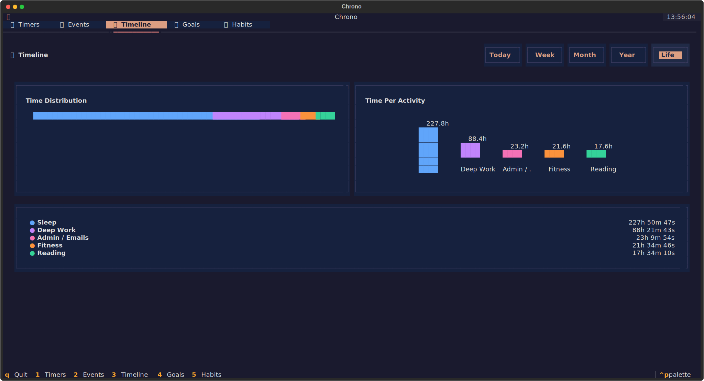
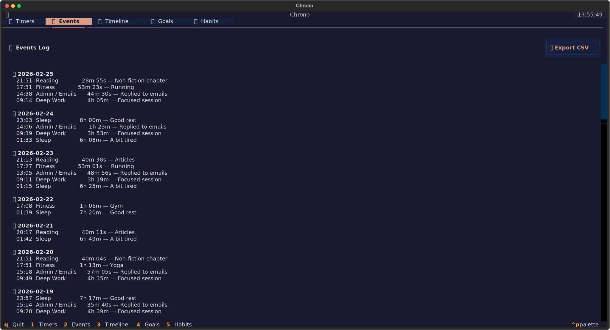

<div align="center">
  <h1>⏱ Chrono</h1>
  <p><b>Track your time, build better habits. All from the comfort of your terminal.</b></p>
</div>

Chrono is a beautiful, privacy-first, local SQLite terminal UI (TUI) for tracking your time and analyzing your habits over time. It is built entirely in Python using [Textual](https://textual.textualize.io/) and [Peewee](http://docs.peewee-orm.com/en/latest/).

Instead of bloated web apps or subscriptions, Chrono keeps all your data locally on your machine in a fast, reliable SQLite database `~/.chrono/data.db`.

<div align="center">
  
</div>

---

## ✨ Features

- **60+ Themes:** Choose from beautiful color schemes via command palette (Solarized, Dracula, Nord, Monokai, etc.)
- **Blazing Fast TUI:** Keyboard-centric design (`Enter` to start/stop, `e` to edit, number keys to switch tabs).
- **Advanced Analytics:** See horizontal distribution and vertical block charts of your time usage.
- **Habit Tracking:** Visualize consistency using GitHub-style contribution block grids.
- **Weekly Goals:** Set and track target hours for deep work, fitness, reading, etc.
- **CSV Export:** Instantly export your raw time entry data.
- **Complete Privacy:** 100% offline. No telemetry, no accounts, no cloud sync.

## 📸 Screenshots

### 📊 Timeline Analytics
Gain deep insights into your habit distribution with custom unicode charts natively rendered in the terminal.
<div align="center">
  
</div>

### 🧩 Habit Tracking
Visualizing specific timer sessions day-by-day.
<div align="center">
  
</div>

### 🎯 Goal setting
Create weekly goals and track their percentage completion automatically.
<div align="center">
  
</div>

### 📋 Event Management
Review your individual blocks of time, edit their notes, or export to CSV.
<div align="center">
  
</div>

## 🚀 Installation & Usage

Chrono requires **Python 3.10+** and uses [uv](https://github.com/astral-sh/uv) for package management.

```bash
# 1. Clone the repository
git clone https://github.com/ever-oli/chrono.git
cd chrono

# 2. Install with uv
uv sync

# 3. Run Chrono!
chrono
# or
python -m chrono
```

### 🎨 Themes

Chrono comes with **60+ beautiful color themes** from [terminal.sexy](https://terminal.sexy) built-in. Switch themes instantly using the command palette:

1. Press `Ctrl+P` to open the command palette
2. Type "theme" to filter theme options
3. Select any theme and it applies instantly without restarting

Popular themes: Solarized Dark, Dracula, Nord, One Dark, Monokai, and many more!

*(Note: The database is automatically initialized at `~/.chrono/data.db` on your first launch.)*

## ⌨️ Keyboard Shortcuts

| Key | Action |
| --- | --- |
| `1` - `5` | Switch between tabs |
| `Enter` / `s` | Start/Stop a highlighted timer |
| `e` | Edit a highlighted timer (rename/color) |
| `Ctrl+P` | Open command palette (search themes, commands) |
| `q` | Quit Chrono |

## 🛠 Tech Stack

- **[Python](https://www.python.org/)** - Core logic
- **[Textual](https://textual.textualize.io/)** - Next-generation Terminal UI framework
- **[Peewee](http://docs.peewee-orm.com/)** - Lightweight ORM for SQLite
- **[SQLite](https://www.sqlite.org/)** - Local data persistence
